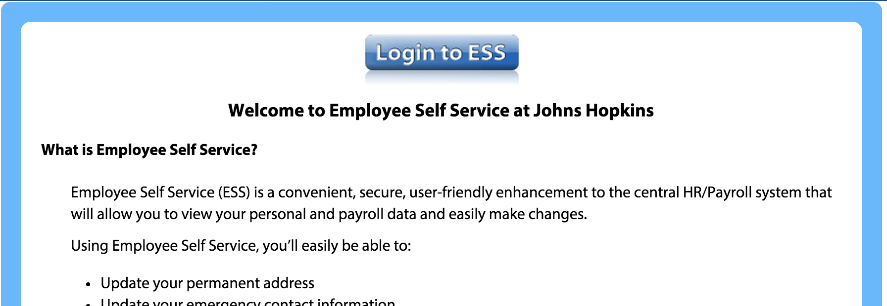

```r
output:
  knitrBootstrap::bootstrap_document:
    title: "Untitled"
    theme: amelia
    highlight: sunburst
    theme.chooser: TRUE
    highlight.chooser: TRUE
```

<link rel="stylesheet" href="https://maxcdn.bootstrapcdn.com/bootstrap/3.3.5/css/bootstrap.min.css">
<link rel="stylesheet" href="https://maxcdn.bootstrapcdn.com/bootstrap/3.3.5/css/bootstrap-theme.min.css">
<script src="https://ajax.googleapis.com/ajax/libs/jquery/1.11.3/jquery.min.js"></script>
<script src="https://maxcdn.bootstrapcdn.com/bootstrap/3.3.5/js/bootstrap.min.js"></script>
<style type="text/css">
    .bs-example{
    	margin: 20px;
    }
</style>

<div class="bs-example">
    <div class="panel-group" id="accordion">
        <div class="panel panel-default">
            <div class="panel-heading">
                <h4 class="panel-title">
                    <a data-toggle="collapse" data-parent="#accordion" href="#collapseOne">1. What is HTML?</a>
                </h4>
            </div>
            <div id="collapseOne" class="panel-collapse collapse in">
                <div class="panel-body">
                    <p>HTML stands for HyperText Markup Language. HTML is the main markup language for describing the structure of Web pages. <a href="http://www.tutorialrepublic.com/html-tutorial/" target="_blank">Learn more.</a></p>
                </div>
            </div>
        </div>
    </div>
</div> 

FAQs

These represent some frequently asked questions (FAQs) or important links to understand your pay.  

<div id="payroll">
1.  Where is my payroll information? 
Here is how you can view your payroll information:

- Go to [http://ess.johnshopkins.edu/](http://ess.johnshopkins.edu/) and see the following page, and click "Login": 
<div style="width:200px; height=200px">

</div>
- Type your JHED Again
- Click "Payroll information" 
</div>


2.  How do I change my number of dependencies/exemptions?

A [W-4 form](http://www.irs.gov/pub/irs-pdf/fw4.pdf) describes the number of dependencies/exemptions you have.  This is important because payroll will tax you differently depending on the number of dependencies.  Dependencies are most commonly children, but you may have other exemptions.  

First, go to your payroll information as described [here](#payroll).  Then 

- Click "Federal and State Withholding"
- Change Exemptions

3.  

- Go to [my.jhu.edu](https://my.jh.edu/portal/web/jhupub/), and click "Login with JHED"
- Type in your JHED information
- On the left hand side, you should see a tab named "HR", and click "ESS":


W-4 
ESS in general
Salary vs. Hourly Pay
1.  ESS
2.  Salary pay
  - 10 hours per week
  - specific project 
  - for 6 months (or could be unspecified)
  - rate
  - The same pay rate but different METHOD - hourly vs. salary
    - calculated on semi-monthly pay and goes by payroll cutoffs
    - if not taken off that position, then will continue
        - may be WRONG and overpaid
3.  Hourly Pay
  - must be submitted
  - paid through hourly system
  - CATS system 
  - the dates are different for the payroll cutoffs
    - 
Where is chart online/
When it's 
[W-2](http://finance.jhu.edu/depts/tax/prtaxt.html)

http://ssc.jhmi.edu/hr_payroll/DataFiles_HR_Payroll/2015_jhu-semi.pdf

http://ssc.jhmi.edu/hr_payroll/deadlines.html

   

JHU Weekly - union
JHU Semi-Monthly - Most JHSPH people (all students, faculty)
  - fixed number of hours
  hourly rate - how much you get paid per hour (can be different per project)
  hourly position 
    - salary or hourly 
    - have different pay periods
JHHS Biweekly - hospital people
</div>
</div>
University formula
  - Salary
    - # hours/week  * wage per hour * 52 weeks /24 pay periods =
    10*25*52/24  = 541.6667
  - hourly
    - not each semi-monthly pay period has the same number of "weeks" in it, so even with the same number of hours in each week, you can get different payments depending on the month breakdown.
    - 10*25*52/26 = 500
  - why is this?  Problem is that months are different numbers of days and we choose to do 2 payments per month - numerator doesn't fit evenly into denominator
    - but overall pay is the same.


CHECK your pay at
1) The beginning of the summer
2) The end of the summer
3) Winter session
